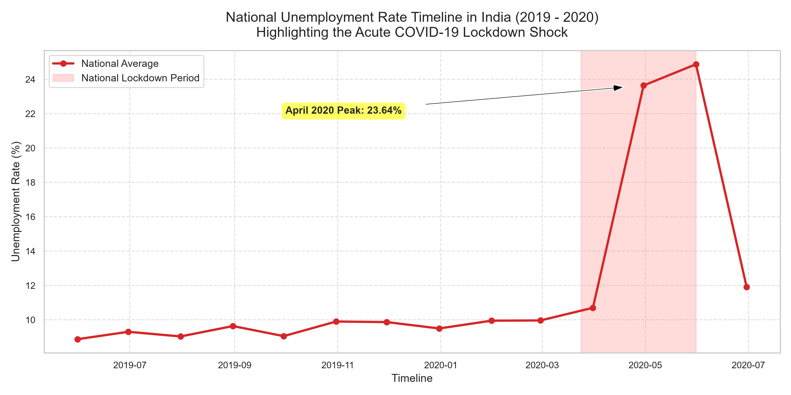
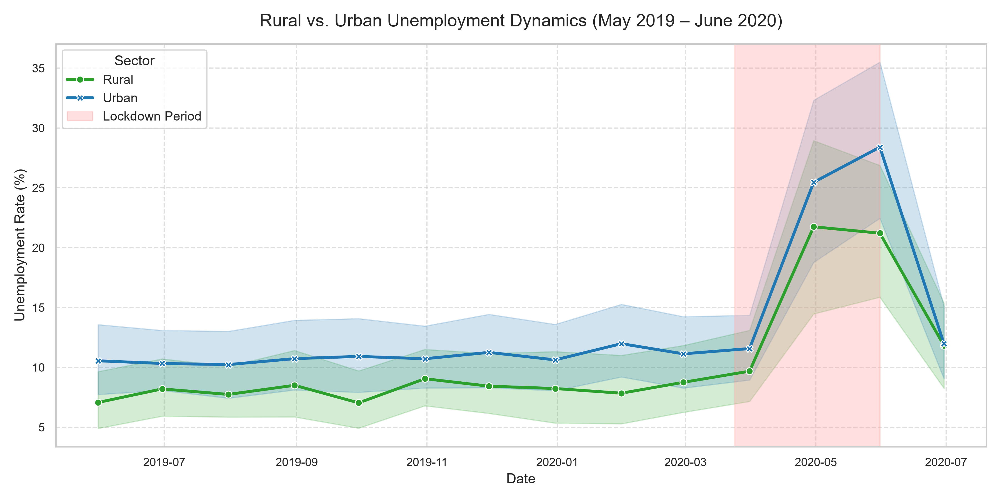
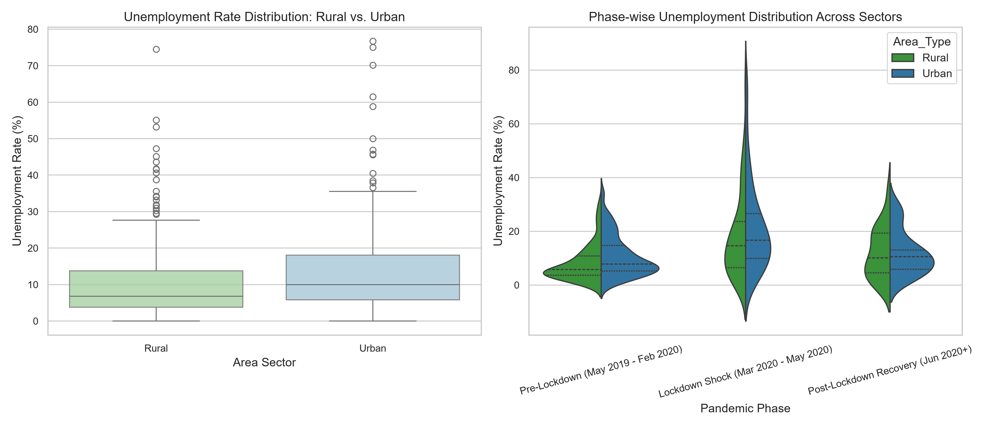
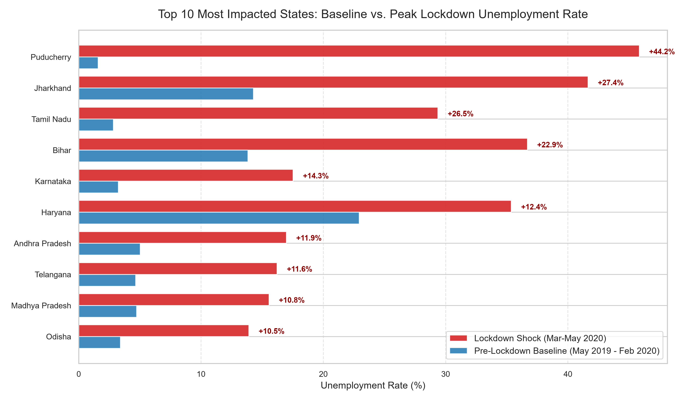
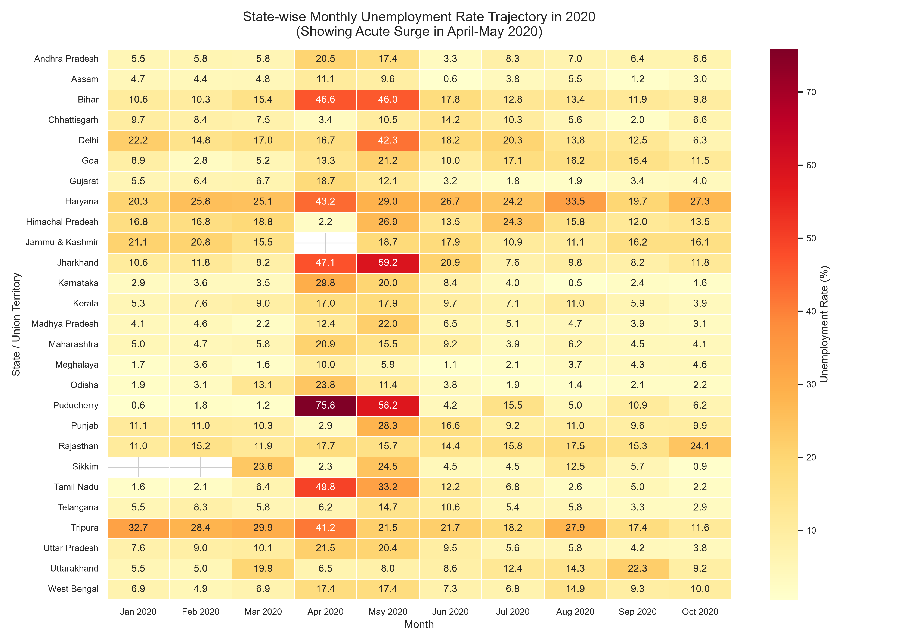
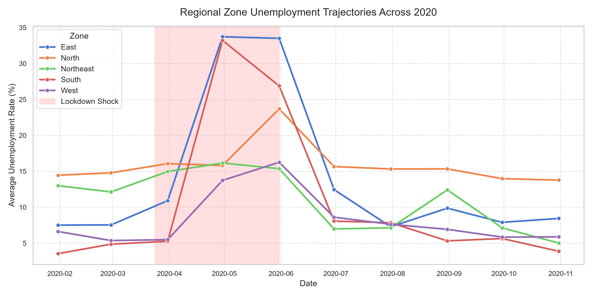
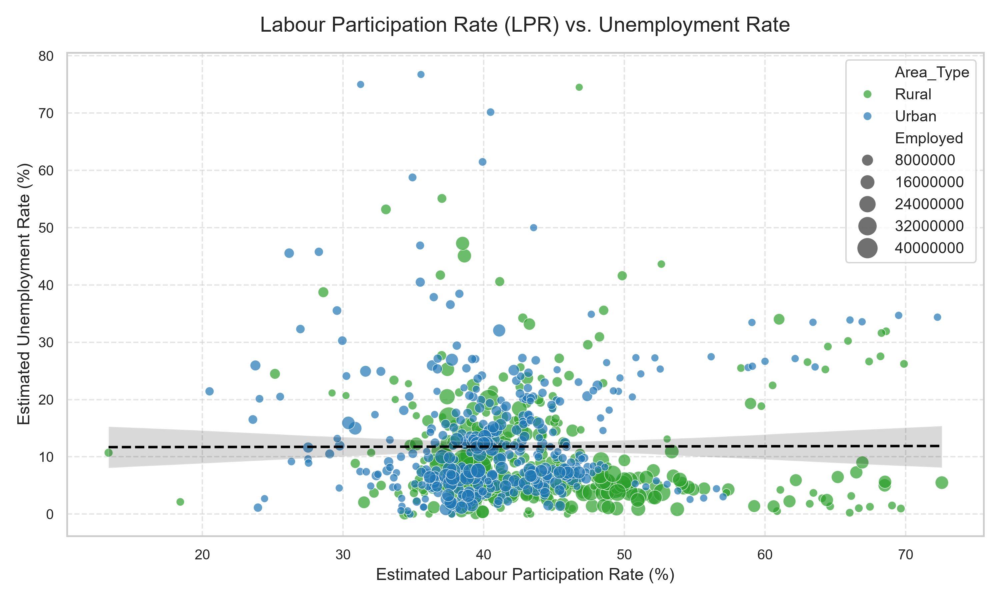
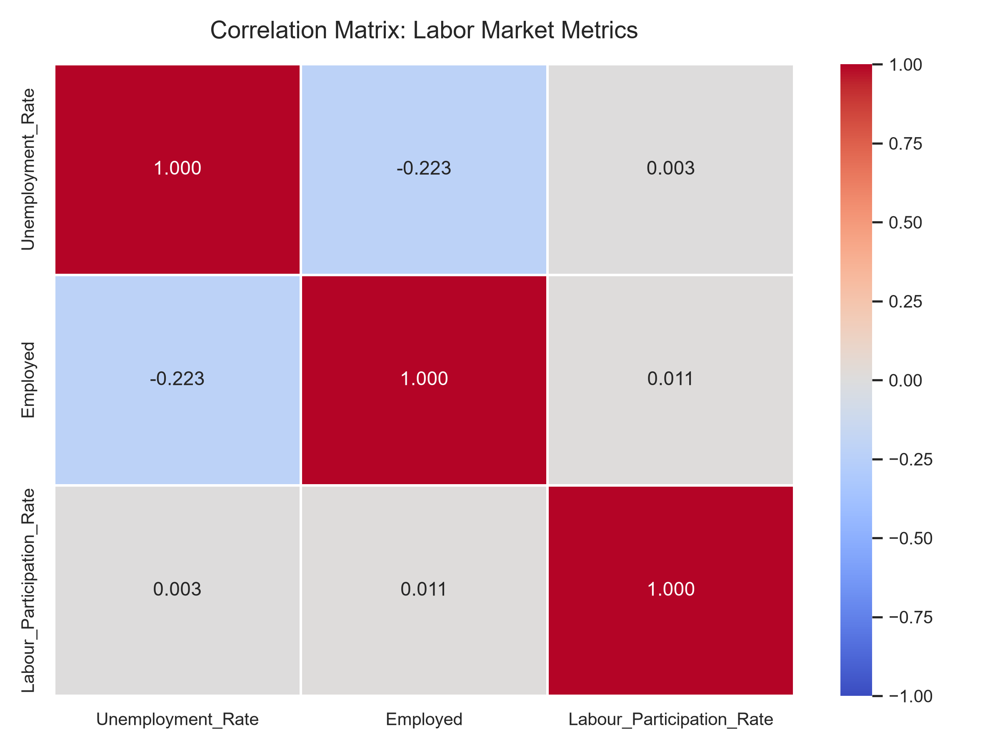
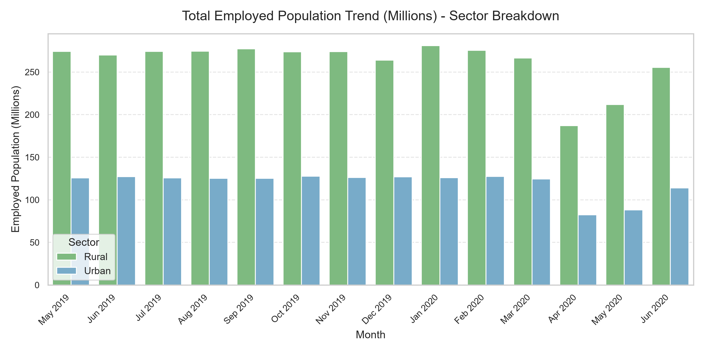
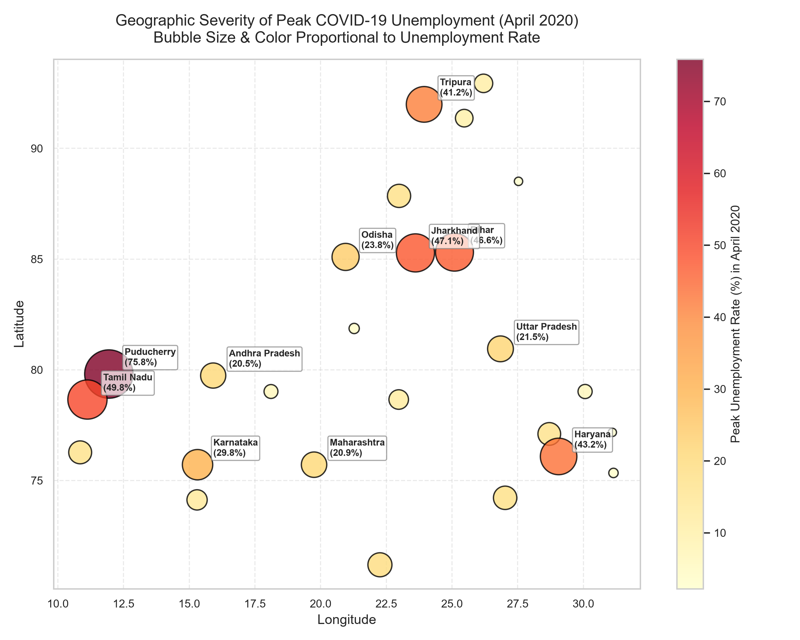

# 📊 India Unemployment Analysis

An exploratory data analysis project studying **unemployment trends in India during 2019–2020**, with a particular focus on the changes observed during the COVID-19 period.

The project uses Python-based data analysis and visualization techniques to examine unemployment patterns across Indian states, compare rural and urban areas, investigate labour participation, and understand the impact of the COVID-19 lockdown on employment.

---

## 📌 Project Overview

Unemployment is an important economic indicator that can vary significantly across regions and time periods.

This project analyzes unemployment-related datasets from Kaggle to answer questions such as:

* How did India's unemployment rate change over time?
* How did unemployment differ between rural and urban areas?
* Which states experienced higher unemployment?
* What changes occurred during the COVID-19 period?
* How does labour participation relate to unemployment?
* What regional patterns can be identified from the data?
* How did employment levels change during the lockdown period?

The project follows a complete data analytics workflow:

**Data Collection → Data Cleaning → Exploratory Data Analysis → Visualization → Insights**

---

## 🎯 Objectives

The main objectives of this project are:

1. Analyze unemployment trends across India.
2. Study unemployment patterns over time.
3. Compare rural and urban unemployment.
4. Identify states with significant changes in unemployment.
5. Examine the effect of the COVID-19 period on employment.
6. Analyze the relationship between labour participation and unemployment.
7. Visualize regional differences using charts and maps.
8. Demonstrate an end-to-end Python data analytics workflow.

---

## 📂 Dataset

The project uses unemployment datasets containing information related to Indian states, unemployment rates, employment estimates, labour participation rates, dates, and area classifications.

### Main datasets

* `Unemployment in India.csv`
* `Unemployment_Rate_upto_11_2020.csv`

### Processed datasets

* `cleaned_unemployment_india.csv`
* `cleaned_unemployment_2020.csv`

The datasets are used for educational and analytical purposes.

---

## 🛠️ Technologies & Tools

| Technology       | Purpose                                |
| ---------------- | -------------------------------------- |
| Python           | Data analysis and processing           |
| Pandas           | Data manipulation and cleaning         |
| NumPy            | Numerical operations                   |
| Matplotlib       | Data visualization                     |
| Seaborn          | Statistical visualization              |
| Plotly           | Interactive visualization              |
| Jupyter Notebook | Exploratory analysis                   |
| Git & GitHub     | Version control and project management |

---

## 🔄 Project Workflow

### 1. Data Collection

The unemployment datasets were obtained from Kaggle and loaded into Python for analysis.

### 2. Data Cleaning

The datasets were prepared for analysis by performing operations such as:

* Handling missing values
* Cleaning column names
* Removing unnecessary records
* Converting data types
* Processing date information
* Preparing datasets for visualization

### 3. Exploratory Data Analysis

The cleaned datasets were explored to identify:

* Overall unemployment trends
* State-level differences
* Rural vs urban patterns
* Labour participation patterns
* Changes during the COVID-19 period

### 4. Data Visualization

Multiple visualizations were created to communicate the findings clearly.

---

# 📈 Visualizations & Analysis

## 1. National Unemployment Trend

Shows how unemployment changed over the analyzed period.



---

## 2. Rural vs Urban Unemployment Trends

Compares unemployment trends between rural and urban areas.



---

## 3. Rural vs Urban Distribution

Provides a distribution-level comparison between rural and urban unemployment.



---

## 4. COVID-19 Impact Across States

Highlights changes in unemployment across selected states during the COVID-19 period.



---

## 5. State-wise Unemployment Heatmap

Visualizes unemployment patterns across Indian states and time periods.



---

## 6. Zone-wise Comparison

Compares unemployment patterns across different geographical zones of India.



---

## 7. Labour Participation vs Unemployment

Examines the relationship between labour participation and unemployment.



---

## 8. Correlation Analysis

Uses a correlation matrix to examine relationships between numerical variables in the dataset.



---

## 9. Employment Loss During Lockdown

Analyzes changes in employment during the COVID-19 lockdown period.



---

## 10. Geospatial Analysis

Uses a geographical visualization to represent unemployment patterns across different regions.



---

# 🔍 Key Areas of Analysis

The project focuses on the following analytical dimensions:

### 📅 Time-based Analysis

Understanding how unemployment changed across different months and periods.

### 🗺️ State-level Analysis

Comparing unemployment levels and changes across Indian states.

### 🏙️ Rural vs Urban Analysis

Examining differences between rural and urban unemployment.

### 🦠 COVID-19 Impact

Studying changes in unemployment and employment during the COVID-19 period.

### 👥 Labour Participation

Exploring the relationship between labour participation and unemployment.

### 🌎 Regional Analysis

Comparing unemployment patterns across geographical zones.

---

# 📁 Project Structure

```text
India-Unemployment-Analysis/
│
├── data/
│   ├── raw/
│   │   ├── Unemployment in India.csv
│   │   └── Unemployment_Rate_upto_11_2020.csv
│   │
│   └── processed/
│       ├── cleaned_unemployment_india.csv
│       └── cleaned_unemployment_2020.csv
│
├── notebooks/
│   └── unemployment_analysis.ipynb
│
├── src/
│   └── unemployment_analysis.py
│
├── images/
│   ├── 01_national_unemployment_trend.png
│   ├── 02_rural_vs_urban_trends.png
│   ├── 03_rural_vs_urban_distribution.png
│   ├── 04_covid_impact_top_states.png
│   ├── 05_state_unemployment_heatmap.png
│   ├── 06_zone_wise_comparison.png
│   ├── 07_labour_participation_vs_unemployment.png
│   ├── 08_correlation_matrix.png
│   ├── 09_lockdown_employment_loss.png
│   └── 10_geospatial_bubble_map.png
│
├── README.md
├── requirements.txt
├── LICENSE
└── .gitignore
```

---

# 🚀 How to Run the Project

## 1. Clone the repository

```bash
git clone https://github.com/shahadattauqir-sudo/Kaggle-Unemployment-data.git
```

## 2. Navigate to the project

```bash
cd Kaggle-Unemployment-data
```

## 3. Install dependencies

```bash
pip install -r requirements.txt
```

## 4. Run the Python analysis

```bash
python src/unemployment_analysis.py
```

Alternatively, open the Jupyter Notebook:

```bash
jupyter notebook notebooks/unemployment_analysis.ipynb
```

---

# 📊 Skills Demonstrated

This project demonstrates practical experience with:

* Python
* Pandas
* NumPy
* Data Cleaning
* Exploratory Data Analysis (EDA)
* Statistical Analysis
* Data Visualization
* Matplotlib
* Seaborn
* Plotly
* Geospatial Visualization
* Correlation Analysis
* Time-Series Analysis
* Git & GitHub
* Data Storytelling

---

# 💡 What I Learned

Through this project, I gained practical experience in:

* Working with real-world datasets
* Cleaning and preprocessing imperfect data
* Performing exploratory data analysis
* Selecting appropriate visualizations for different questions
* Comparing trends across regions
* Identifying relationships between variables
* Communicating analytical findings through visualizations
* Organizing a data analytics project using GitHub

---

# 🔮 Future Improvements

Potential improvements include:

* Build an interactive **Streamlit dashboard**
* Add more recent unemployment datasets
* Perform statistical hypothesis testing
* Add machine learning models for unemployment prediction
* Create automated data pipelines
* Add interactive geographical visualizations
* Compare unemployment trends across multiple years
* Integrate data from official government sources
* Add automated data-quality checks

---

# ⚠️ Limitations

* The analysis is based on the available dataset and its time period.
* Historical unemployment data may not represent current unemployment conditions.
* COVID-19 created unusual economic conditions that may affect comparisons.
* Dataset quality and completeness can influence analytical results.
* Correlation analysis does not by itself establish causation.

---

# 📚 References

* Kaggle unemployment datasets
* Government of India open-data resources
* Python documentation
* Pandas documentation
* Matplotlib documentation
* Seaborn documentation
* Plotly documentation

---

# 👨‍💻 Author

**Md Shahadat Tauqir**

B.Tech Computer Science & Engineering (Data Science)

Interested in:

`Python` · `Data Analytics` · `AI Automation` · `Business Intelligence` · `Data Science`

---

⭐ If you found this project useful, consider giving the repository a star.
